# PROCESS-SCHEDULING-PROJECT
•	Developed process Scheduling algorithms(FCFS, Round Robin, Priority Pre-emptive and non Pre-emptive , Shortest job first Pre-emptive and non Pre-emptive).
•	Created GUI using C++ QT framework to take processes data and algorithms then show the order and time taken by each process (Gantt Chart) and Average waiting time. 

#  Background
## What is the Process Scheduling?
The process scheduling is the manager handles the removal of the running process from the CPU and selects another process on the Ready Queue using a particular strategy, it‘s an important part of Multiprogramming .which allows more processes to be loaded to the memory for execution at the same time and the loaded processes share the CPU by multiplexing.

## What are the Process Scheduling algorithms Types?
- There are four popular process scheduling algorithms:
  -	First come First serve (FCFS)
  - Round Robin 
  - Priority 
  - Shortest job first
- Two concepts :
  - Pre-emptive: is mean if there is a process working in CUP and a process arrived the process working In the CPU may be interrupted 
  - Non-pre-emotive: it means the process that is working on the CPU can’t be interrupted for any reason only for waiting for the I/O device or the end of the execution time.

## What is the project requirements?
Develop a project that takes process information, those processes have to schedule to be executed by the CPU and visualize how the processes are scheduled in the CPU according to a specific algorithm. 
- Inputs: 
  - Type of scheduler(Algorithm).
  - No of Processes. 
  - Required information about each process according to the scheduler type. 
- Outputs: 
  - Timeline showing the order and time taken by each process (Gantt Chart).
  - Average waiting time using.
## The Algorithms
1. **FIRST COME FIRST SERVE:**
the algorithm gives higher priority to the process which arrives earlier, so it is really like the Queue and is implemented using the Queue data structure. 

2. **ROUND ROBIN:**
The algorithm is really useful for the user interface as it gives each process a slice of time to be executed by the processor which makes the programs more interactive.

3. **RIORITY PRE-EMPTIVE:**
This algorithm executes the processes according to the priority, the lower priority process executes first, but as it is pre-emptive it can interrupt the process which takes the CPU if it has a priority less than the newcomer.

4. **PRIORITY NON-PRE-EMPTIVE:**
This algorithm executes the processes according to the priority, the lower priority process executes first, but as it Is non-pre-emptive it can’t interrupt the process which takes the CPU till this process need i/o operation or complete execution.

5. **SHORTEST JOB FIRST PRE-EMPTIVE:**
This algorithm gives the shortest process higher priority, and as it is pre-emptive the process which on the processor can be interrupted if a shorter one arrived and must be shorter than the remainder burst time of the one on the processor.

6. **SHORTEST JOB FIRST NON-PRE-EMPTIVE:**
This algorithm gives the shortest process higher priority, but as it Is non-pre-emptive it can’t interrupt the process which takes the CPU till this process need i/o operation or complete execution.

# Project Implementation
## Design overview
### Flow chart
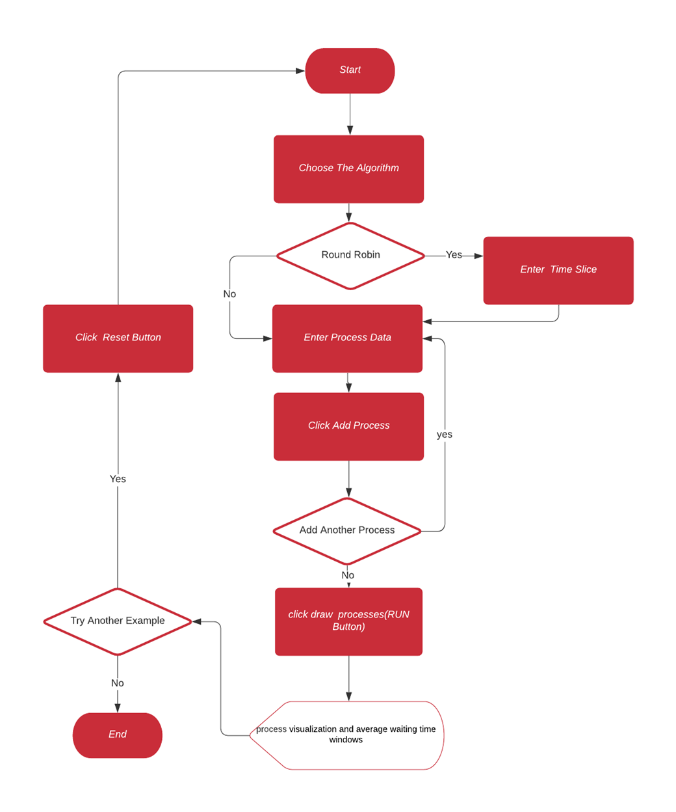
### Class diagram
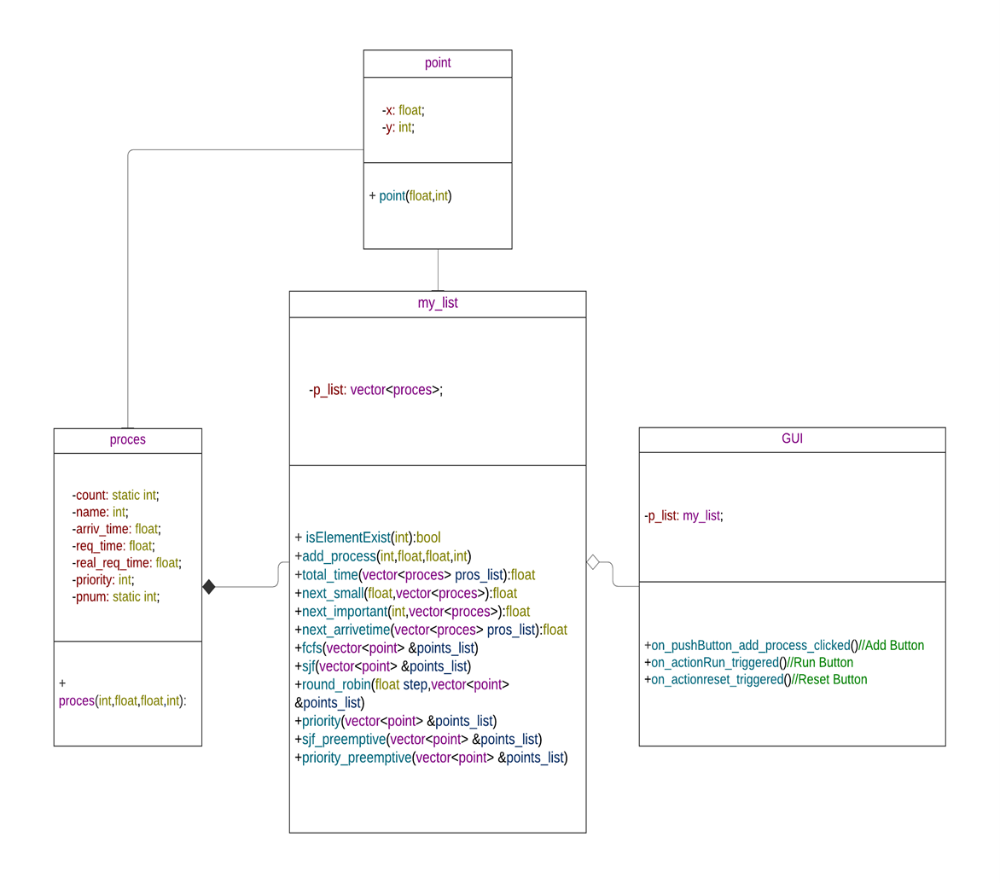

### Classes Description
- The process class is used to represent the process data.
- The point class is used to represent the points (start and end for each process) to be drawn in the chart.
- Class my list used to arrange and apply the algorithms on the processes.
- Class GUI responsible for interfacing.

## Gui

| GUI interface                |
|------------------------------|
| 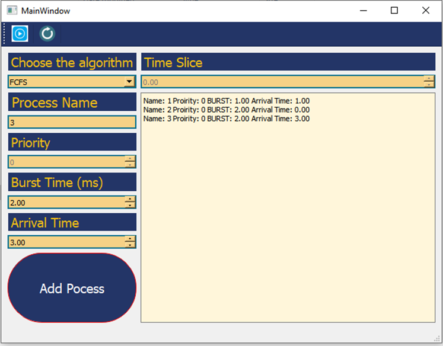 |

| Process history              | Average waiting time         |
|------------------------------|------------------------------|
| 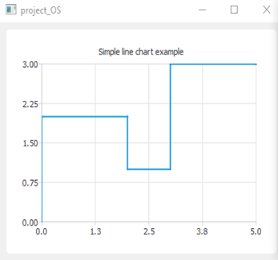 | 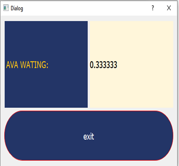 |

### User Guide
1.	The user **should** choose the algorithm.
2.	User starts **adding processes data** (Name, Burst Time, Arrival Time, and Priority if any of the Priority algorithms have been chosen).
3.	**Click Add Process** button to add the process data then it would appear in the text area on the right.
4.	**Add slice time if the round-robin has been chosen** 
5.  **Click the Run button**.
6.  The average waiting time and the visualization windows of the Processes Scheduling would appear as in figure 2 and figure 3.
7.  User can **reset** the program by USING the RESET BUTTON (icon on the top left)for adding new data and having another algorithm.

**Small Note:** one of the project's weaknesses is the graph, which makes it unclear to the user exactly when the process begins and when it ends. That happened because I used the charts library, but now I learned a better way to draw this type of chart using the graphics view library, as I used it in another project to draw the memory space.

# Execution examples
## 1. **FIRST COME FIRST SERVE:**
- Input: 
  - P1 arrived at time 2
  - P2 arrived a time 3
  - P3 arrived at time 1
  - P4 at time 0
  - All have the same burst time 4 s.
- Expected output:
  - P4 then P3 then P1 the P2
  - The average waiting time: sigma(finish time-arrival time-burst time)for all process/(number of process) = (p1(12-2-4)+p2(16-3-4)+p3(8-1-4)+p4(4-0-4))/4=4.5. 

Project output:

| GUI interface                |
|------------------------------|
| 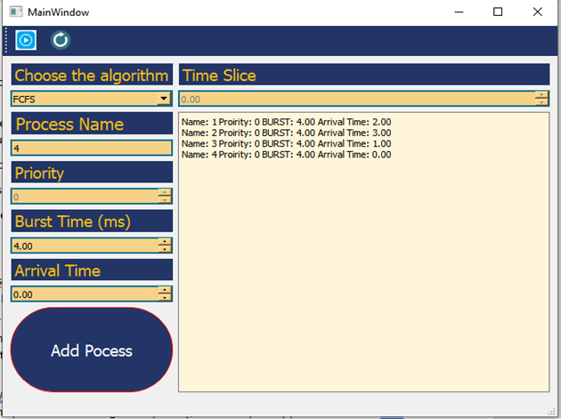 |

| Process history                | Average waiting time         |
|--------------------------------|------------------------------|
| 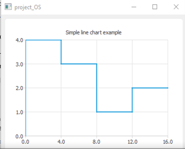   | 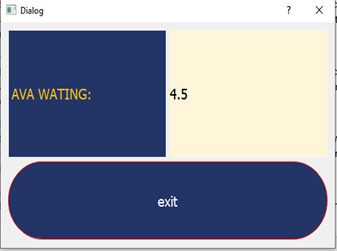 |

## 2. **ROUND ROBIN:**
- Input:
  - P1 arrived at time 0
  - P2 arrived a time 0
  - P3 arrived at time 1
  - P4 at time 1
  - All have the same burst time 4 s with slice time 1 s.

Project output:

| GUI interface                    |
|----------------------------------|
| 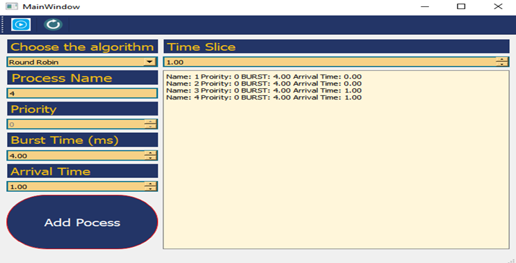     |

| Process history                  | Average waiting time         |
|----------------------------------|------------------------------|
| 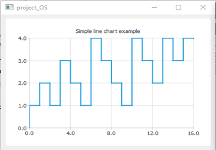    | 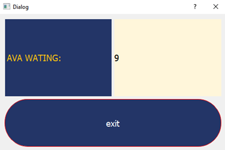 |

## 3. **RIORITY PRE-EMPTIVE:**
- Input:
  - P1 arrived at time 0  PRIORITY 1
  - P2 arrived a time 1 PRIORITY 0
  - P3 arrived at time 2 PRIORITY 2 
  - All have the same burst time 4 s

- Expected output:
  - At time 0: P1 the only one so would start executing.
  - At time 1: P2 arrives and has higher PRIORITY. So, it would take the processor.
  - At time 2: P3 arrives, and it has lower PRIORITY than p2 which executes on the processor. So, it would wait till p2 finishes then search for the next higher PRIORITY which is p1 than p3.
  - The average waiting time: sigma(finish time-arrival time-burst time)for all process/(number of process) = (p1(8-0-4)+p2(5-1-4)+p3(12-2-4))/3=3.3333.
	
Project output:

| GUI interface                  |
|--------------------------------|
| 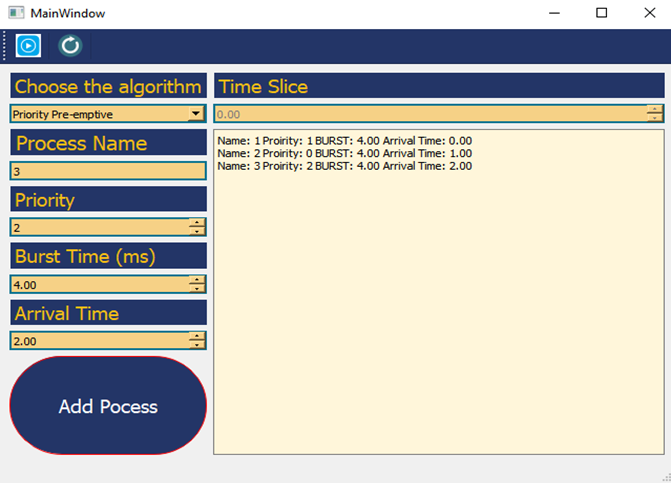  |

| Process history               | Average waiting time         |
|-------------------------------|------------------------------|
| 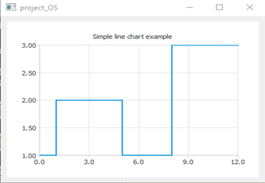 | 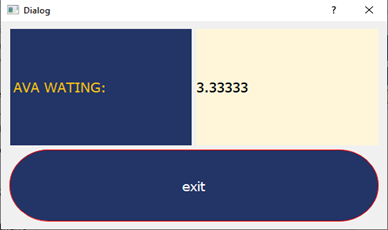 |

## 4. **PRIORITY NON-PRE-EMPTIVE:**
Example of :
- Input:
  - P1 arrives at time 0 with burst time 9 
  - P2 arrives at time 2 with burst time 7
  - P3 arrives at time 5 with burst time 1
-Expected output:
  - At time 0: p1 execute
  - At time 2: (p1 size =7)=(p2 size=7) p1 continue.
  - At time 5: (p1 size =4)>(p3 size =1)p3 execute.
  - At time 6: p3 finish (p1 size =4) < (p2 size =7) p1 execute.
  - At time 10: p2 execute.
  - the average waiting time: sigma(finish time-arrival time-burst time) for all process/(number of process) = (p1(10-0-9)+p2(17-2-7)+p3(6-5-1))/3=3.

  
Project output:

| GUI interface                 |
|-------------------------------|
| 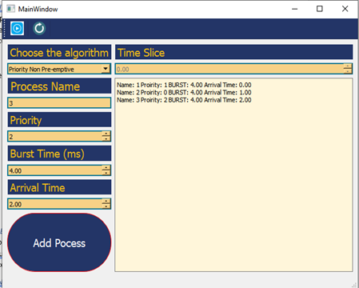 |

| Process history                | Average waiting time         |
|--------------------------------|------------------------------|
| 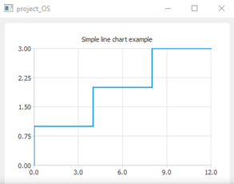  | 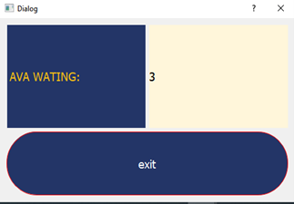 |

## 5. **SHORTEST JOB FIRST PRE-EMPTIVE:**
Example of :
- Input:
  - P1 arrives at time 0 with burst time 9 
  - P2 arrives at time 2 with burst time 7
  - P3 arrives at time 5 with burst time 1
-Expected output:
  - At time 0: p1 execute
  - At time 2: (p1 size =7)=(p2 size=7) p1 continue.
  - At time 5: (p1 size =4)>(p3 size =1)p3 execute.
  - At time 6: p3 finish (p1 size =4) < (p2 size =7) p1 execute.
  - At time 10: p2 execute.
  - the average time: sigma(finish time-arrival time-burst time) for all process/(number of process) = (p1(10-0-9)+p2(17-2-7)+p3(6-5-1))/3=3.

Project output:

| GUI interface                   |
|---------------------------------|
| 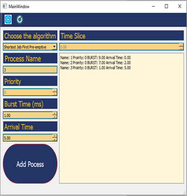   |

| Process history                | Average waiting time         |
|--------------------------------|------------------------------|
| 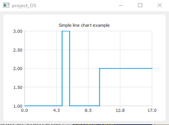  | 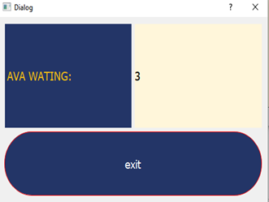 |

## 6. **SHORTEST JOB FIRST NON-PRE-EMPTIVE:**
- Input:
  - P1 arrives at time 0 with burst time 9 
  - p2 arrives at time 2 with burst time 7
  - p3 arrives at time 5 with burst time 1
- Expected output:
  - at time 0: p1 execute till end 
  - at time 9: (p2 size =7)>(p3 size=1) p3 execute till ends.
  - at time 10: p2 execute.
  - the average time: sigma(finish time-arrival time-burst time) for all process/(number of process) =(p1(9-0-9)+p2(17-2-7)+p3(10-5-1))/3=4.

Project output:

| GUI interface                |
|------------------------------|
| 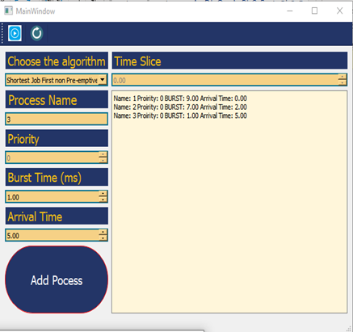 |

|  Process history              | Average waiting time         |
|-------------------------------|------------------------------|
| 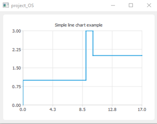 | 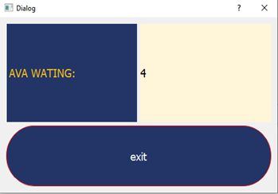 |